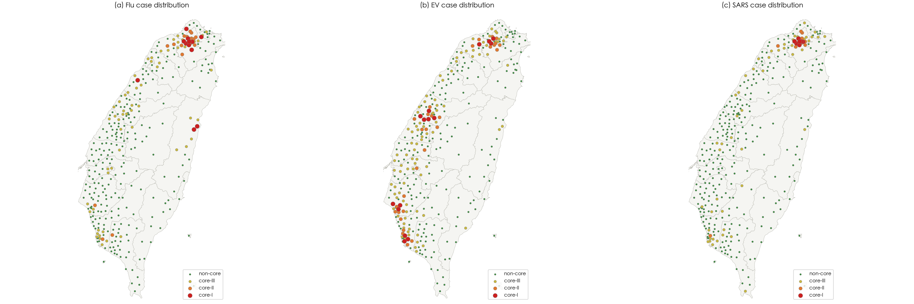
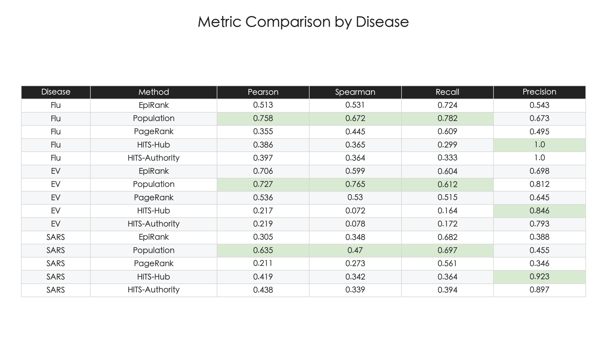
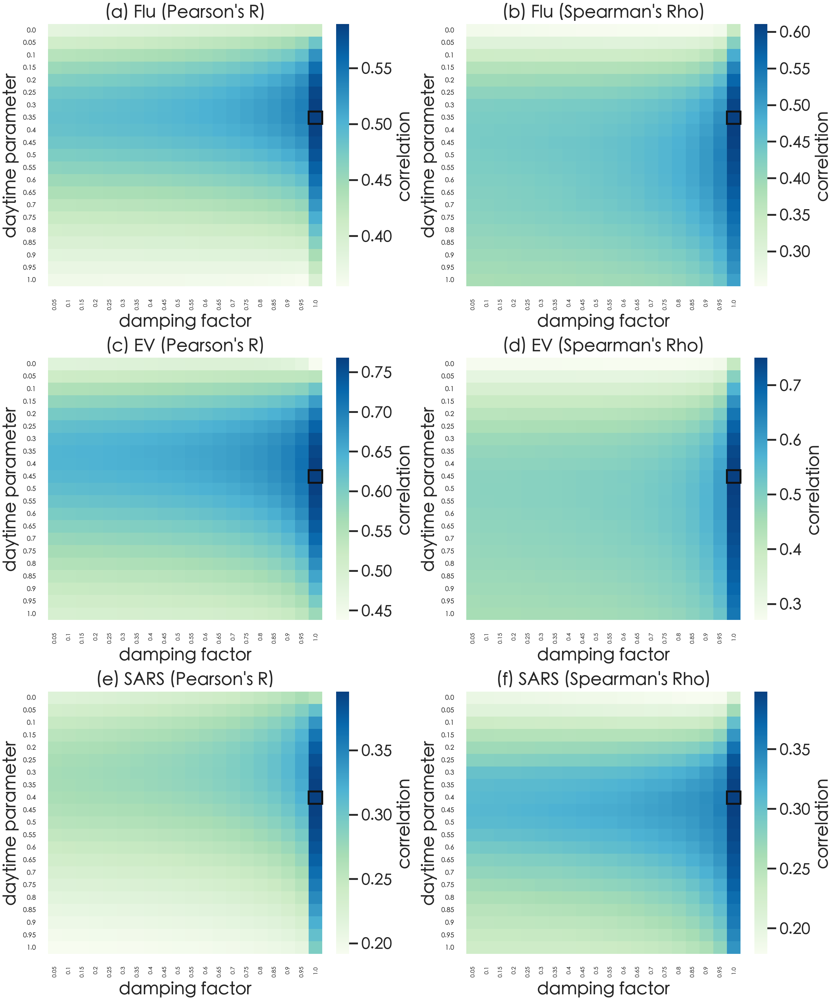
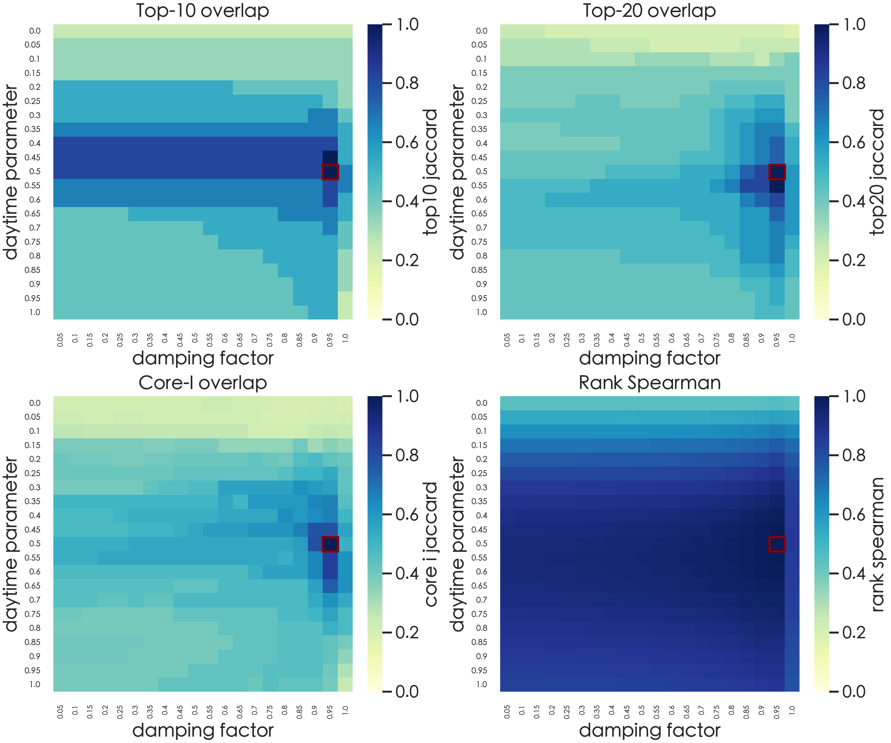

# Reproducing and Stress-Testing EpiRank

This repository reproduces and extends the paper:

Huang CY, Chin WC, Wen TH, Fu YH, Tsai YS. 2019. **EpiRank: Modeling Bidirectional Disease Spread in Asymmetric Commuting Networks.** *Scientific Reports*, 9:5415. https://doi.org/10.1038/s41598-019-41719-8

The original code is based on https://github.com/wcchin/EpiRank. This version reorganizes the workflow into scripts that are easier to rerun, compare, and extend for a Networks and Dynamics final project.

## Project Summary

EpiRank is a PageRank-inspired Markov-chain method for ranking epidemic risk on an asymmetric commuting network. Nodes are Taiwan townships, and directed weighted edges represent commuting flows from home locations to work or school locations. The key modeling idea is that disease risk can move in both directions: from residences to workplaces during the day, and from workplaces back to residences during return travel.

This project has three goals:

- Reproduce the core EpiRank workflow and compare it with PageRank, HITS-Hub, and HITS-Authority.
- Extend the original reproduction to include SARS in addition to H1N1 flu and Type-71 enterovirus.
- Stress-test the model under different daytime parameters, damping factors, external factors, self-loop assumptions, and ranking-stability metrics.

The main conclusion is that EpiRank is useful as a **network-based spatial risk ranking tool**, but it should not be interpreted as a full epidemic simulator. It does not model susceptible/infected/recovered states, temporal outbreak dynamics, incubation periods, or disease-specific transmission probabilities. The robustness experiments show that population and network construction choices materially affect the results.

## Key Findings

- Bidirectional EpiRank generally matches observed disease-risk patterns better than one-directional baselines.
- Backward movement often matters more than forward movement, with strong performance appearing when the daytime parameter is slightly below or near 0.5.
- Population is a strong baseline because the observed outcomes are raw case counts rather than per-capita incidence.
- A population-weighted external factor improves performance and makes parameter results more stable.
- Removing self-loops can slightly improve agreement with observed cases, but it also makes rankings less stable across parameters.
- Remote islands with only self-loops expose a classification edge case: these nodes converge close to their external-factor baseline and can sit near head/tail break thresholds.

## Example Outputs

Disease severity maps for flu, enterovirus, and SARS:



Comparison of EpiRank with baselines across diseases:



Sensitivity of EpiRank performance across daytime and damping parameters:



Ranking stability across parameter settings:



## Repository Layout

- `data/`: Taiwan township workbook dataset: `bs.xlsx`, `cn.xlsx`, `Flu.xlsx`, `ev.xlsx`, and `SARS.xlsx`.
- `data_sars/`: SARS case-study files, including commuting flows, SARS counts, point coordinates, and Taiwan GeoJSON files.
- `data_flow/`: legacy example origin-destination flow data.
- `scripts/EpiRank/`: reusable package code for EpiRank, data loading, additional metrics, and plotting.
- `scripts/run_taiwan_dataset.py`: main workbook-based reproduction and robustness runner.
- `scripts/plot_paper_figures.py`: figure-oriented workflow for reproducing paper-style plots.
- `scripts/sars_run/`: standalone SARS replication workflow.
- `results/`: generated CSV tables and PNG figures.
- `requirements.txt`: Python dependencies.

## Environment

Use Python 3.10 or newer with NetworkX 3.x.

```bash
conda create -n epirank python=3.10
conda activate epirank
pip install -r requirements.txt
```

Core dependencies:

```text
networkx>=3.0
numpy>=1.24
pandas>=2.0
openpyxl>=3.1
scipy>=1.10
matplotlib>=3.7
seaborn>=0.12
```

Optional notebook support:

```bash
pip install notebook nbconvert ipykernel
```

## Quick Start

Run the default Taiwan workbook analysis:

```bash
python scripts/run_taiwan_dataset.py
```

This writes:

- `results/taiwan/ranking.csv`
- `results/taiwan/correlations.csv`
- `results/taiwan/epirank_breaks.csv`
- EpiRank maps and summary figures under the configured figures directory

Run the full parameter grid:

```bash
python scripts/run_taiwan_dataset.py --parameter-grid
```

Run parameter-stability analysis:

```bash
python scripts/run_taiwan_dataset.py --stability
```

Run both robustness outputs together:

```bash
python scripts/run_taiwan_dataset.py --parameter-grid --stability
```

## Full Reproduction Guide

All commands below should be run from the repository root:

```bash
cd Net_Dyns_Project_EpiRank
```

### 1. Reproduce Main Taiwan Results

```bash
python scripts/run_taiwan_dataset.py
```

Default model assumptions:

- `daytime = 0.5`
- `damping = 0.95`
- uniform external factor
- self-loops included unless `--exclude-selfloop` is passed

Main outputs:

- `results/taiwan/ranking.csv`: township EpiRank scores, core levels, population, and disease counts.
- `results/taiwan/correlations.csv`: Pearson, Spearman, Kendall, recall, and precision for EpiRank, population, PageRank, HITS-Hub, and HITS-Authority.
- `results/taiwan/epirank_breaks.csv`: head/tail break thresholds.
- `results/taiwan/figures/correlations_table.png`: rendered comparison table.
- `results/taiwan/figures/epirank_scores.png`: EpiRank score map.
- `results/taiwan/figures/epirank_levels.png`: EpiRank core classification map.

### 2. Reproduce Paper-Style Figures

```bash
python scripts/plot_paper_figures.py
```

This writes paper-style figures to:

```text
results/paper_figures/
```

To include the parameter-grid figure:

```bash
python scripts/plot_paper_figures.py --grid
```

Important outputs include:

- `figure_3_disease_frequency.png`
- `figure_4_disease_map.png`
- `figure_7_epirank_map.png`
- `figure_8_overlay_map.png`
- `figure_9_epirank_vs_disease.png`
- `figure_10_index_comparison.png`
- `figure_11_parameter_grid.png`

### 3. Run Daytime and Damping Sensitivity

```bash
python scripts/run_taiwan_dataset.py --parameter-grid
```

This evaluates:

```text
daytime = 0.00, 0.05, ..., 1.00
damping = 0.05, 0.10, ..., 1.00
```

Outputs:

- `results/taiwan/parameter_grid.csv`
- `results/taiwan/figures/parameter_grid.png`

Use coarser steps for a fast check:

```bash
python scripts/run_taiwan_dataset.py --parameter-grid --daytime-step 0.5 --damping-step 0.5 --loops 100
```

### 4. Run Ranking-Stability Analysis

The parameter grid measures performance against observed disease counts. It does not directly answer whether the same high-risk townships remain high-risk. For that, run:

```bash
python scripts/run_taiwan_dataset.py --stability
```

The stability analysis compares each parameter setting with the reference setting defined by `--daytime` and `--damping`, defaulting to:

```text
daytime = 0.5
damping = 0.95
```

Outputs:

- `results/taiwan/parameter_stability.csv`
- `results/taiwan/figures/parameter_stability.png`

Stability metrics:

- `top10_jaccard`: top-10 township overlap with the reference ranking.
- `top20_jaccard`: top-20 township overlap with the reference ranking.
- `core_i_jaccard`: overlap of highest-risk `C-I` townships.
- `rank_spearman`: Spearman correlation between full rankings.
- `rank_kendall`: Kendall correlation between full rankings.
- `top10_mean_rank_shift`: average rank movement among reference top-10 towns.
- `top20_mean_rank_shift`: average rank movement among reference top-20 towns.

### 5. Test Population-Weighted External Factor

The original paper mainly uses a uniform external factor. To test whether population improves prediction:

```bash
python scripts/run_taiwan_dataset.py \
  --exfac population \
  --parameter-grid \
  --stability \
  --figures-dir results/taiwan/figures_population
```

For paper-style figures:

```bash
python scripts/plot_paper_figures.py \
  --exfac population \
  --grid \
  --output-dir results/paper_figures_population
```

### 6. Test Network Assumptions Without Self-Loops

To focus on inter-township movement only:

```bash
python scripts/run_taiwan_dataset.py \
  --exclude-selfloop \
  --parameter-grid \
  --stability \
  --figures-dir results/taiwan/figures_wo_sl
```

Population-weighted external factor without self-loops:

```bash
python scripts/run_taiwan_dataset.py \
  --exclude-selfloop \
  --exfac population \
  --parameter-grid \
  --stability \
  --figures-dir results/taiwan/figures_ppl_wo_sl
```

Interpretation: excluding self-loops can slightly improve disease-count agreement because it emphasizes inter-township flow, but it removes a local-retention term from the EpiRank update and therefore tends to reduce parameter stability.

### 7. Run Standalone SARS Replication

Quick check:

```bash
python scripts/sars_run/run_for_sars.py --daytime-step 0.5 --damping-step 0.5 --top-n 3
```

Full sensitivity run:

```bash
python scripts/sars_run/run_for_sars.py --daytime-step 0.05 --damping-step 0.05 --top-n 10
```

Then generate SARS-specific plots:

```bash
python scripts/sars_run/plot_sars_results.py
```

Outputs:

- `results/sars/movement_comparison.csv`
- `results/sars/baseline_comparison.csv`
- `results/sars/sensitivity.csv`
- `results/sars/top_scores.csv`
- `results/sars/figures/`

## Reproducing Report Figures

The final report uses the following figure families:

- Disease distributions: `results/paper_figures/figure_4_disease_map.png`
- EpiRank maps under different daytime values: `results/paper_figures/figure_7_epirank_map.png`
- EpiRank overlays on observed disease maps: `results/paper_figures/figure_8_overlay_map.png`
- Baseline comparison: `results/taiwan/figures/correlations_table.png`
- Parameter sensitivity: `results/taiwan/figures/parameter_grid.png`
- Population external-factor sensitivity: `results/taiwan/figures_population/parameter_grid.png`
- Self-loop sensitivity: `results/taiwan/figures_wo_sl/parameter_grid.png`
- Stability comparison: `results/taiwan/figures/parameter_stability.png`, `results/taiwan/figures_population/parameter_stability.png`, and `results/taiwan/figures_wo_sl/parameter_stability.png`

## Notes on Interpretation

EpiRank should be read as a relative risk-ranking model, not a disease simulator. It produces a stationary township score from a commuting network, but it does not simulate infection events over time. This distinction matters because raw disease counts are strongly influenced by population size. In this project, the population baseline performs competitively, and population-weighted EpiRank improves both performance and stability.

Self-loops also matter. With self-loops included, nodes retain part of their risk at each update, which makes rankings more stable. Without self-loops, more risk mass is redistributed through inter-township edges, which can improve fit but increases sensitivity to `daytime` and `damping`.

## Notes on Imports

Scripts locate the repository root from their file location and add `scripts/` to Python's import path. This allows imports such as:

```python
from EpiRank import epirank
from EpiRank import additional_analysis
```

Because paths are resolved from the repository layout, scripts can be launched from the repository root or by absolute path from another working directory.
